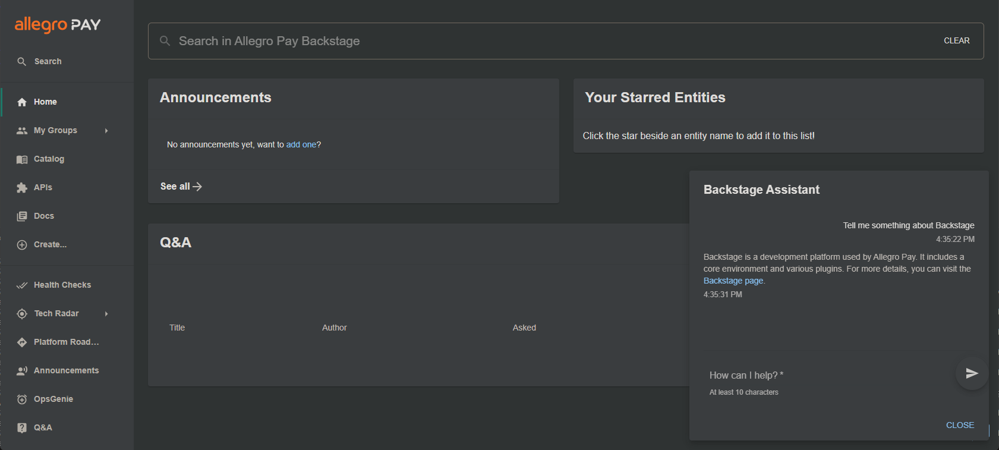

# Backstage Assistant



This Spotify Backstage plugin integrates an AI-powered assistant using [Azure OpenAI Service](https://azure.microsoft.com/en-us/products/ai-services/openai-service) and the [Backstage search engine](https://github.com/backstage/backstage/tree/master/plugins/search) to provide smart, contextual responses to your questions. The assistant can automate routine tasks, offer intelligent suggestions, and help you quickly find relevant information within your Backstage environment. Designed to enhance productivity, it seamlessly integrates into your workflow, making it easier to manage and interact with Spotify services.

## Configuration

TODO: add package

Modify your app routes to include the ChatButton component, for example:

```tsx
// In packages/app/src/App.tsx
import { ChatButton } from '@internal/backstage-plugin-chat-bot';

export default app.createRoot(
  <>
    <AlertDisplay />
    <OAuthRequestDialog />
    <AppRouter>
      <Root>{routes}</Root>
      <RequirePermission
        permission={/* Permissions required to use assistant */}
        errorPage={<></>}
      >
        <ChatButton />
      </RequirePermission>
    </AppRouter>
  </>,
);
```

## How assistant works

#### 1. User Interaction:

The user begins by asking a question within the Backstage interface.

#### 2. Multi-Query Retrieval:

The assistant modifies the user's original question into multiple query variations using a multi-query retriever mechanism. This helps to capture different ways the question could be interpreted.

#### 3. Search Execution:

Each generated query is passed to the Backstage search engine, which retrieves the top 3 relevant results for each query.

#### 4. Document Filtering:

The results are processed using an [embeddings](https://platform.openai.com/docs/guides/embeddings) model. By applying [cosine similarity](https://en.wikipedia.org/wiki/Cosine_similarity), the assistant identifies which documents most likely contain the answer to the user's question.

#### 5. Context Building:

The selected documents are passed to the AI model as context to provide relevant information for the answer generation.

#### 6. Answer Generation:

Using the provided context, the AI assistant generates a precise and informative response for the user.
